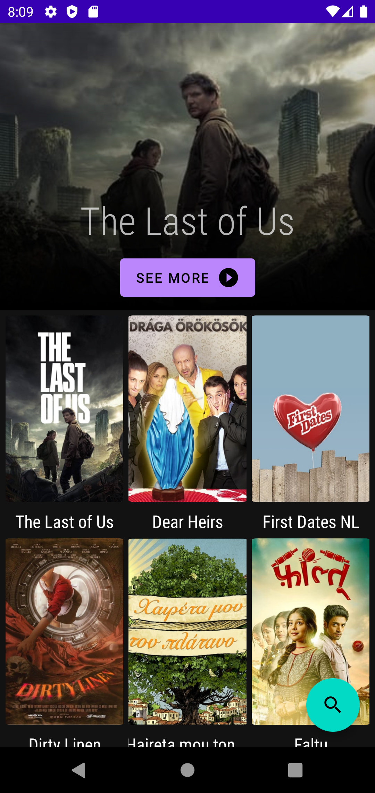
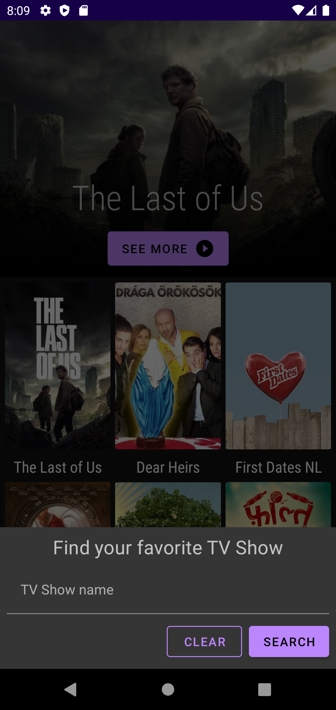
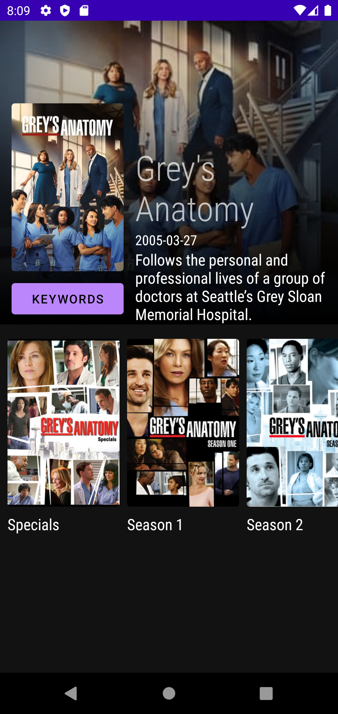
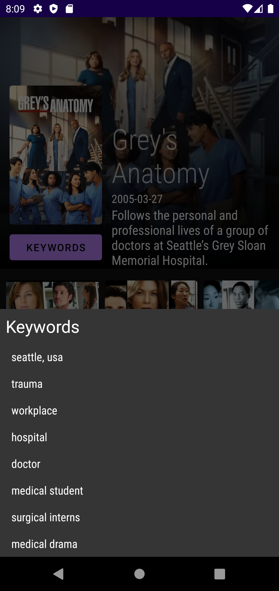
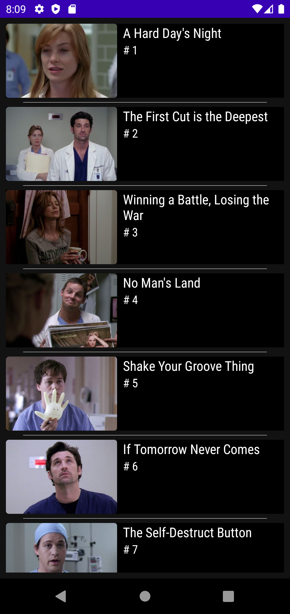

# Series

A challenge proposed by **Void Software**

This challenge is testing:

- Create and set up a project
- Basic Android functionality
- REST API integration
- Kotlin/Java usage
- Unit-testing
- Layout implementation

## Requirements

For this challenge is necessary to use the TheMovieDB API endpoints to construct the
app. https://api.themoviedb.org/3/

Create a screen that should have a search field and a list of results. When no search query is
provided the list must present the list of popular shows.

Create another screen that should present the details of a selected TV show.
The TV Show details screen need to display:

- Name
- Images
- List of keywords
- List of episodes (Filtered by season)

## Extra features

Splash screen

🍻Light Theme / Dark Theme
